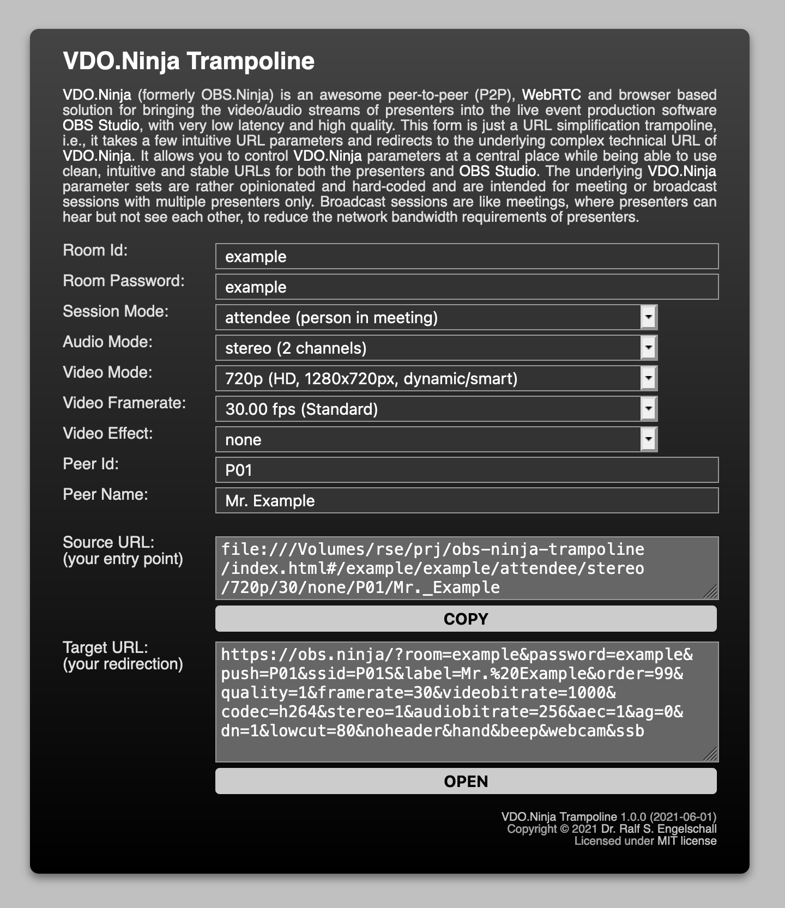

[OBS.Ninja Trampoline](https://rse.github.io/obs-ninja-trampoline/)
===================================================================

About
-----

[OBS.Ninja](https://obs.ninja) is an awesome peer-to-peer (P2P),
[WebRTC](https://webrtc.org/) and browser based solution for bringing
the video/audio streams of presenters into the live event production
software [OBS Studio](https://obsproject.com) with very low latency and
high quality.

This form is just a URL simplification trampoline, i.e., it takes a
few intuitive URL parameters and redirects to the underlying complex
technical URL of [OBS.Ninja](https://obs.ninja). It allows you to
control [OBS.Ninja](https://obs.ninja) parameters at a central place
while being able to use clean, intuitive and stable URLs for both the
presenters and [OBS Studio](https://obsproject.com).

The underlying [OBS.Ninja](https://obs.ninja) parameter sets are rather
opinionated and hard-coded and are intended for meeting or broadcast
sessions with multiple presenters only. Broadcast sessions are like
meetings, where presenters can hear but not see each other, to reduce
the network bandwidth requirements of presenters.

Sneap Preview
-------------

Usage
-----

Go to [OBS.Ninja Trampoline](https://rse.github.io/obs-ninja-trampoline/)
(or your own website hosting OBS.Ninja Trampoline) and just use the form.
The form fields are:

- **Room Id**:
  This is the room identifier, corresponding to the `room` parameter of
  OBS.Ninja. It has to be globally unique.

- **Room Password**:
  This is the room password, corresponding to the `password` parameter of
  OBS.Ninja. It protects access to your room.

- **Session Mode**:
  This is the mode the peer is operating under:
  - **attendee**:
    a person in a regular meeting, i.e., all attendees share their video
    and audio to each other. This causes lots of WebRTC connections and
    hence should be used for about 5-10 peers only. This is intended for
    regular meeting participants.
  - **sender**:
    a person in a broadcast meeting, i.e., all sender share only their
    audio with each other and their video with just the director (in
    lower-quality) and the receiver (in high-quality). This is intended
    for presenters in a produced online event.
  - **follower**:
    like **sender**, but without sharing video at all. This is intended
    for assistents in a produced online event in order to observe the
    senders.
  - **injector**:
    like **follower**, but without even sharing audio at all. This is
    intended for assistents in a produced online event in order to just
    inject chat messages to the senders.
  - **receiver**:
    the OBS Studio "Browser Source" receiving the video/audio stream
    of a particular sender.
  - **director**:
    the director of the online event in order to control
    the senders and interact with the senders.

- **Session Video**:
  This is the video mode the peer is operating under, mapped onto the
  `quality` and`videobitrate` parameters of OBS.Ninja.

- **Session Audio**:
  This is the audio mode the peer is operating under, mapped onto the
  `stereo` and `audiobitrate` parameters of OBS.Ninja.

- **Peer Id**:
  This is the peer identifier, corresponding to the `view` and `push`
  parameters of OBS.Ninja. It has to be locally unique to the room identifier.

- **Peer Name**:
  This is the peer name, corresponding to the `label` parameter of
  OBS.Ninja. It can be an arbitrary name, but should explain the peer.
  It is displayed to the director only.

- **Source URL**:
  This is your entry point.
  Copy this URL for accesssing OBS.Ninja through the clean, intuitive
  and stable parameters of OBS.Ninja Trampoline.

- **Target URL**:
  This is the redirection URL, based on the underlying complex parameters
  of OBS.Ninja. This is shown just for comprehension purposes.

Installation
------------

There is no installation needed if you are using the Github URL
https://rse.github.io/obs-ninja-trampoline/. If you want to
use a different URL then copy the files [index.html](index.html)
and [jquery.js](jquery.js) to your own website.

License
-------

Copyright &copy; 2021 [Dr. Ralf S. Engelschall](http://engelschall.com/)

Permission is hereby granted, free of charge, to any person obtaining
a copy of this software and associated documentation files (the
"Software"), to deal in the Software without restriction, including
without limitation the rights to use, copy, modify, merge, publish,
distribute, sublicense, and/or sell copies of the Software, and to
permit persons to whom the Software is furnished to do so, subject to
the following conditions:

The above copyright notice and this permission notice shall be included
in all copies or substantial portions of the Software.

THE SOFTWARE IS PROVIDED "AS IS", WITHOUT WARRANTY OF ANY KIND,
EXPRESS OR IMPLIED, INCLUDING BUT NOT LIMITED TO THE WARRANTIES OF
MERCHANTABILITY, FITNESS FOR A PARTICULAR PURPOSE AND NONINFRINGEMENT.
IN NO EVENT SHALL THE AUTHORS OR COPYRIGHT HOLDERS BE LIABLE FOR ANY
CLAIM, DAMAGES OR OTHER LIABILITY, WHETHER IN AN ACTION OF CONTRACT,
TORT OR OTHERWISE, ARISING FROM, OUT OF OR IN CONNECTION WITH THE
SOFTWARE OR THE USE OR OTHER DEALINGS IN THE SOFTWARE.

